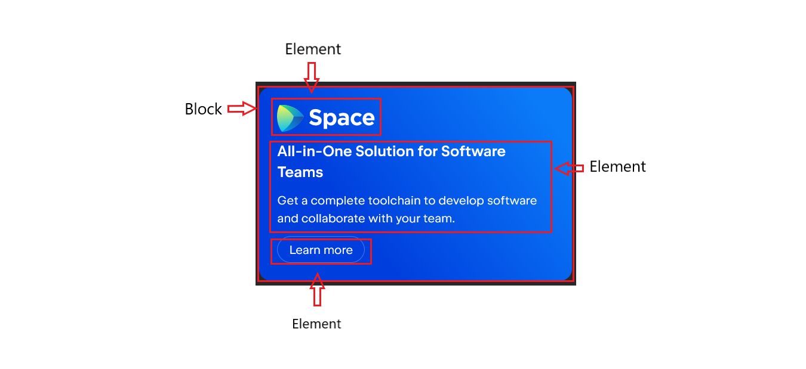

#BEM - Block, Element, Modifier

1. BEM only relies on CSS class names to apply styles
2. The most common blocks in a website are headers, content, cards, footers, and so on.
3. block__element--modifier
4. Block names are usually a single word like .content long words must be separated by a hyphen -.
5. An element can only have one parent block and can't be used outside its parent block.

>.block { ... }

>.content__element { ... }
>
> .search__input { ... }

>.navbar__items { ... }
 
> .content__article { ... }

>.header--modifier { ... }

>.block__element--modifier { ... }

> .form__button--green { ... }   block__element--modifier 

> 

>.card { ... } /* block */

>.card__title { ... } /* block__element */

>.card__info { ... }

>.card__button { ... }

>.card__button--green { ... } /* block__element--modifier */

<section class="card">
    
    
 Card Information

</section>